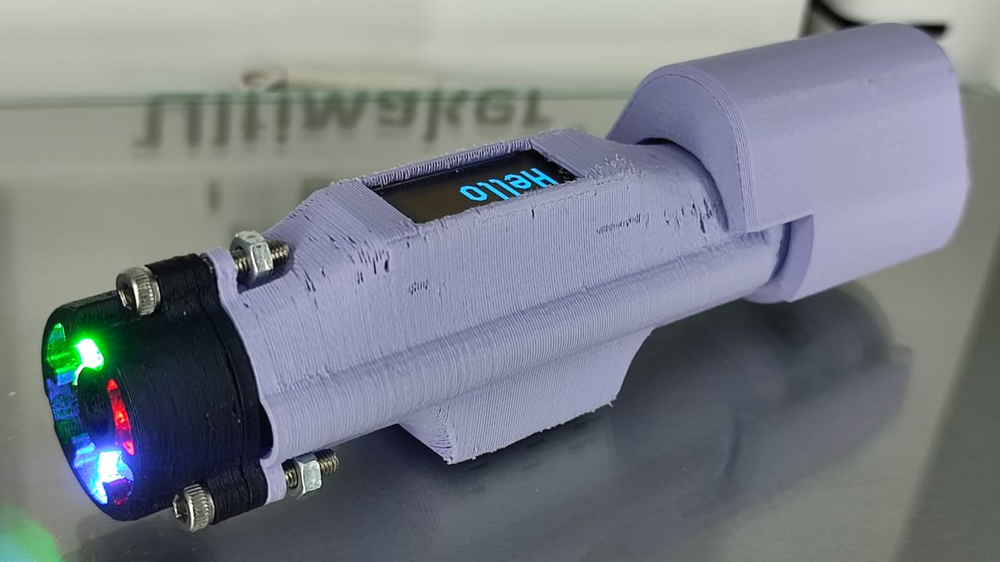
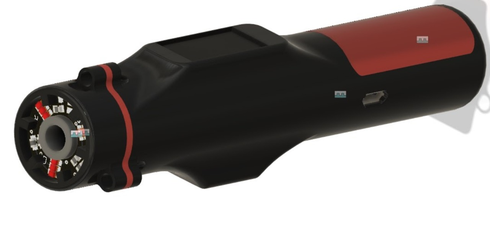
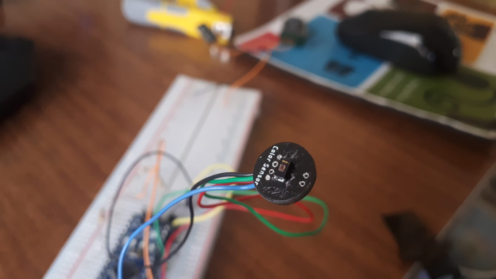
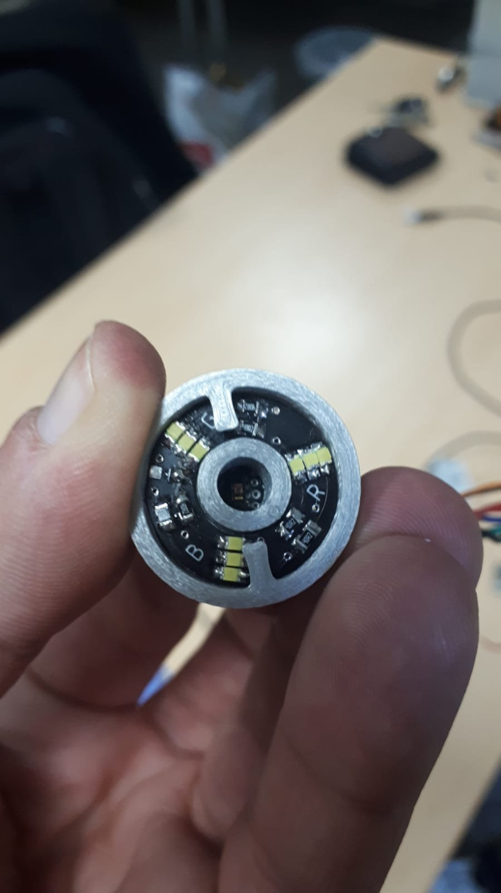
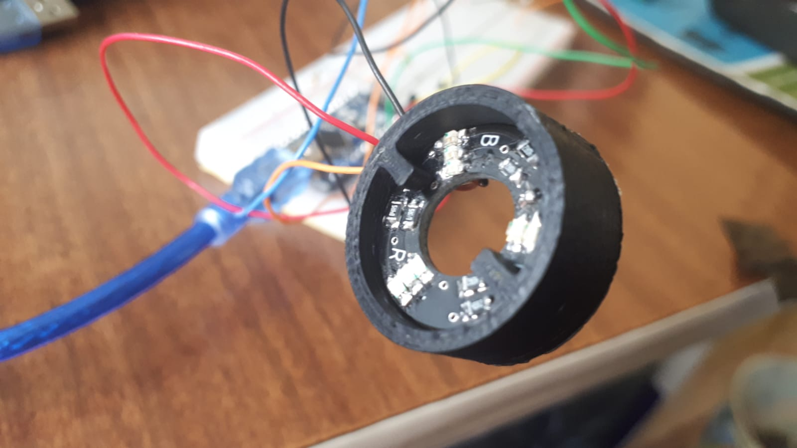
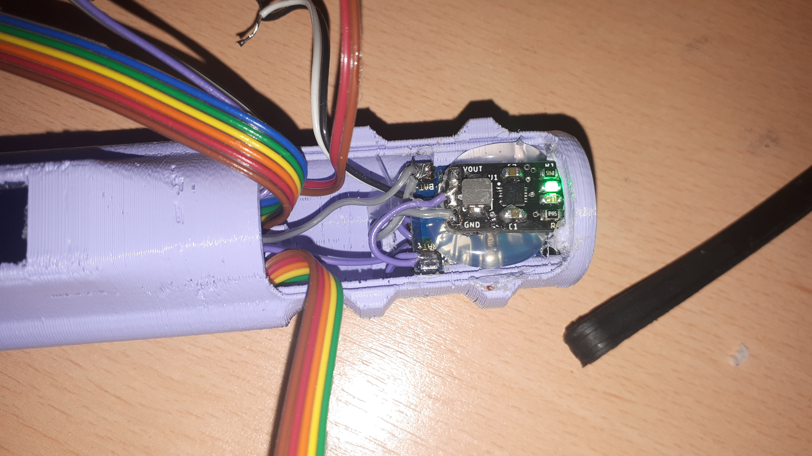
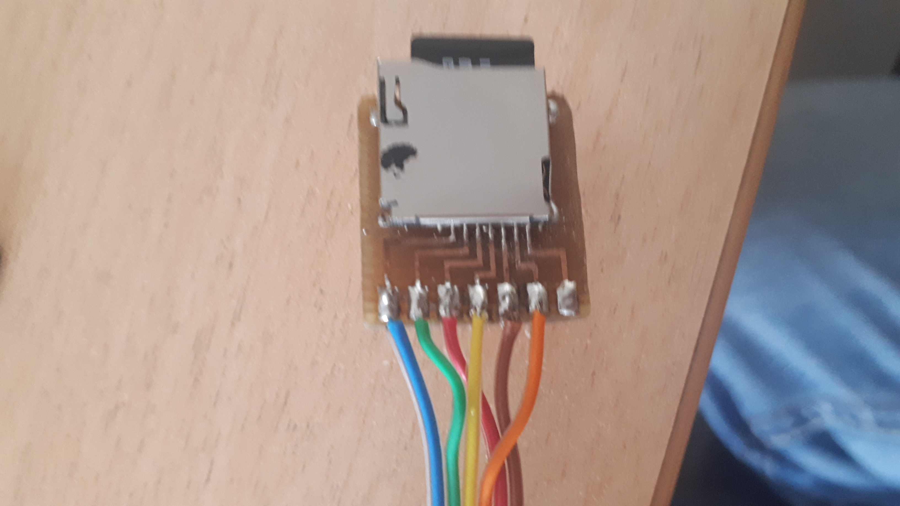
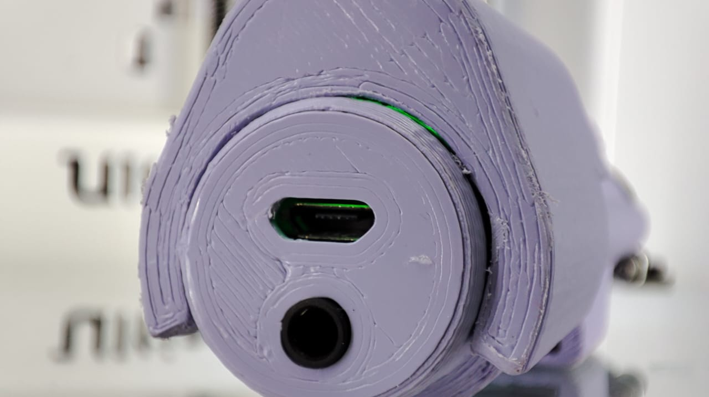
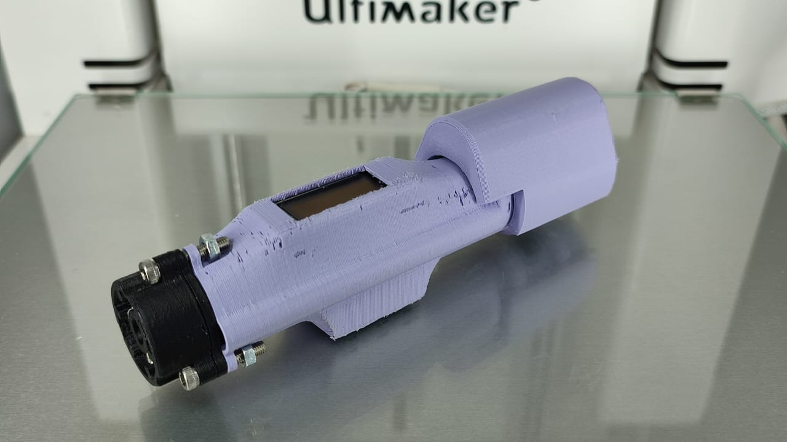
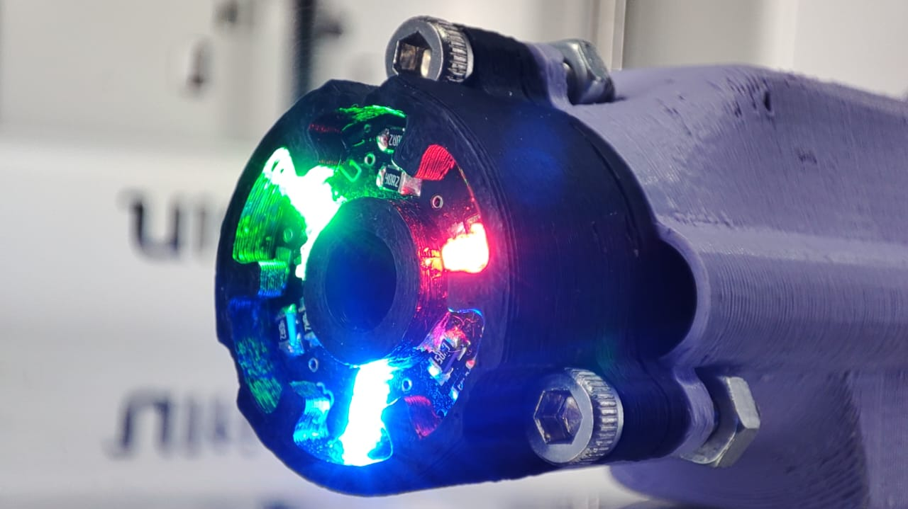

# Color sensor
A compact device that helps the blind and color blind to differentiate between colors. The devices shows the color on the top screen and has an AUX plug for voice. Fully rechargable, lasting over 10 hours.

# Work progress

